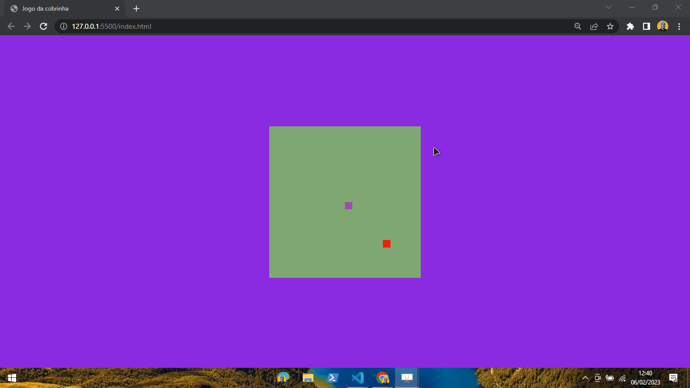

<h1 align="center">
   🐍SNAKE-GAME🐍
</h1>

<h4 align="center">
  💻 Simple snake game to remember great childhood moments
</h4>

# Photo 🎴
   

   

   

   
   <a href="#On">On</a> .
   <a href="#Roadmap">Roadmap</a> .
   <a href="#Technologies">Technologies</a> .
   <a href="#Photos">Photos</a> . 
   <a href="#Author">Author</a> 
   
 

   
 # On 🗨
     
     
   
 This is a project to recreate the snake game, where I'm styling it more
      current so that it has the face of modernity!  

   
   
   
   
   
   # Roadmap ✔
   
   
 I really missed the games that marked the 90s, when I decided
   making this application, even though it is simple and certainly too much fun and tests
   your skills! 

   
   
   # Technologies 📰
   <h3 align="center">  Technologies used in the project 🙃 </h3>

   

- [HTML](https://www.w3schools.com/html/)
- [CSS](https://www.w3schools.com/css/)
- [JavaScript](https://www.javascript.com/)
   
   
   # Author 🙋‍♂️
   
 Hello, my name is João.   Follow me on <a href="https://www.linkedin.com/in/joaosoaressilva/" target="_blank">Linkedin</a> to see more about the projects I post.!

